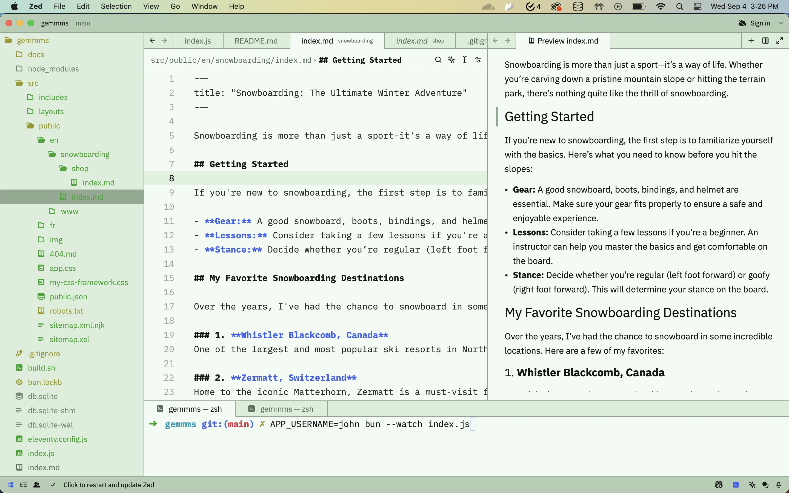
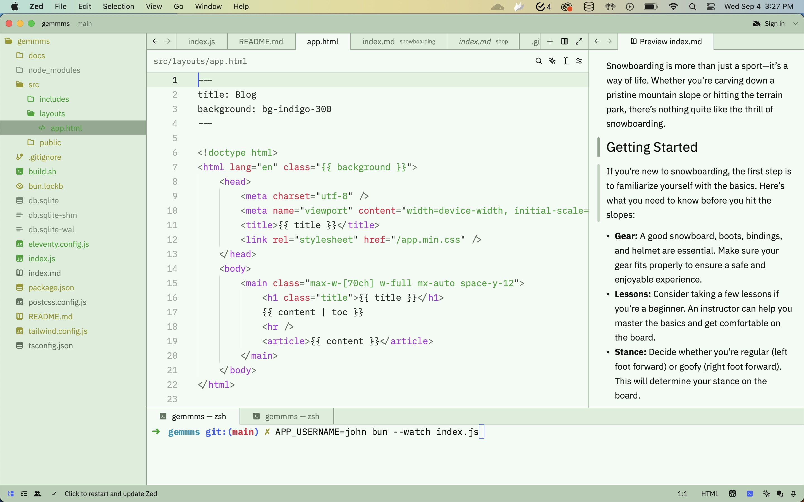
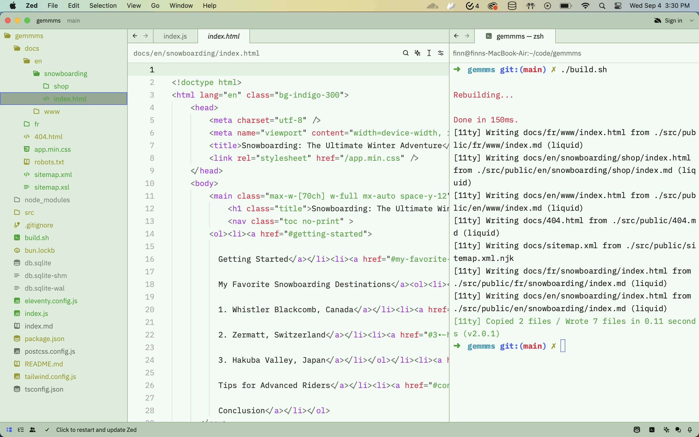

# Chione - Snow Builds Kickstart

In memory are those who struggle to share. This repo is dedicated to them. You've got this!

## Origin

> In Greek mythology, Chione or Khionê (Ancient Greek: Χιονη from χιών – chiōn, "snow") was the daughter of the Oceanid Callirrhoe and Nilus. She was raped by a local peasant and transformed into a snow cloud by Hermes at the order of Zeus. From the clouds she cast snow (khiôn) upon the desert. The Greek word for snow (χιών chiōn) was thought to have come from her name.
>
> _[The Wikipedia Article](https://en.wikipedia.org/wiki/Chione_(daughter_of_Callirrhoe))_

## Introduction
Chione provides several avenues for generating static content. Authors should start simple. From there, they may wish to continue or combine ideas into something greater.

## Folder Structure
The `src` folder houses your unpublished thoughts. The first level of folders specify the broadest scope. By default, "language" is assumed to be the broadest scope. Just fork the repository. From there, do what you want.

## Getting Started
1. Fork the repository
2. Install dependencies [See bun installation](https://github.com/oven-sh/bun)
3. Build static files `./build.sh`
4. Share `docs` directory with world

## Screenshots
Only because if I were you, I'd want to see what I'm getting into. Food for thought.

## Advanced
This step is optional and only necessary if you want to rewrite URLs. Doing so means your content depends on a server and will ultimately cost money to publish. Hosting static content for free is possible if you search around, yet "compute" is what you desire.

1. Run `bun index.js`
2. Modify server to fit your needs
3. Publish

## Stack
Oh yes how could this be forgotten. Chione is built on the following technologies:
* Bun
  * I18N routing
  * Analytics
* 11TY
  * Static Site Generation
  * Markdown
  * Templating (Liquid, Nunjucks, EJS, etc.)
* CSS
  * PostCSS
  * TailwindCSS

## Purpose
This project aims to provide ground for thoughts. Please be mindful.

## Intent
Changes to this repository are not welcome at this time. Please fork and create your own apps.

## Disclaimers
Security, accessibility, performance, etc. are deferred. Chione provides rudimentary I18N. Concerns will not be addressed at this time. Please make your own framework.

## License
MIT

## Credits
Adobe, ChatGPT, Wikipedia, and subject matter are not my own. All rights reserved.
